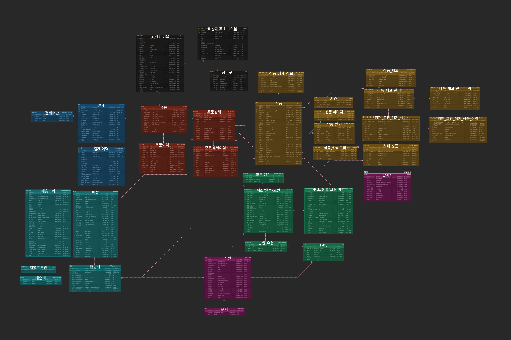

# **신사 숙녀 쇼핑몰**
## 목차
- [프로젝트 개요](#-프로젝트-개요-overview--description)
- [기술 스택](#-기술-스택-tech-stack)
- [진행 상황](#-진행-상황-progress)
- [폴더 구조](#-폴더-구조-optional-but-helpful)
- [시작 방법](#-시작-방법-getting-started)
- [팀원 소개](#-팀원-소개-optional)
- [주요 기능](#-주요-기능-features)
- [ERD 설계](#-erd-설계-erd-design)
- [API 명세서](#-api-명세서-api-specification)
- [화면정의서](#-화면-정의서-screen-definition)
- [시연 영상](#-시연-영상-demonstration-video)

### 📖 프로젝트 개요 (Overview / Description)

- **20, 30대를 위한 깔끔하고 트랜디**한 
- 
- UI/UX를 제공하는 **의류 쇼핑몰**
- 벤치마킹 쇼핑몰: **무신사 스토어** (https://www.musinsa.com/main/musinsa/recommend)
- 무신사처럼 **온라인 패션 스토어**이며, **자체 상표 브랜드**
- **모던/베이식/캐주얼**한 의류 제품을 공장에서부터 **입고, 진열, 관리, 판매, 배송, 고객 관리** 등을 한 번에 관리할 수 있는 **자체 쇼핑몰**
- **다양한 구매 방식**을 제공해 **사용자 만족도**를 높임

### 🛠️ 기술 스택 (Tech Stack)

- Java 21
- Spring Boot 3.2.0
- MySQL 8.0.41
- MyBatis

### ✅ 진행 상황 (progress)

1. **프로젝트 구현 및 실행 조건** - 2025.03.10 ~ 2025.03.16 (완)
    - ERD툴을 이용한 논리 모델링 작성
    - 물리 모델링 & 테이블 생성 및 데이터 입력 스크립트 작성
    - MySQL8.x 데이터 베이스에 물리 모델 구축
2. **서비스 구현** - 2025.03.16 ~ 2025.03.19 (완)
    - 기술 버전 결정
    - 각자 화면 정의서, 요구사항 정의서, 기술 정의서를 바탕으로 각 파트 구현
3. **테스트** - 2025.03.20 ~ 2025.03.28 (완)
    - 각자 개발한 파트 유닛 테스트 진행
    - 원활한 사용자 UX를 위해 예외 처리
    - 전체적인 흐름에서 부터 세부적인 흐름으로 들어가면서 정의서와 맞게 구현되어 있는지 체크
4. **발표 자료 정리 및 준비** - 2025.03.28 ~ 2025.03.30 
    - 각자 개발한 서비스 정리
    - 흐름도 정리
    - README.md 업데이트
5. **발표** - 2025.03.31
    - 본인 파트 발표 및 Q&A
6. **리팩토링 및 Spring/JPA 변환** - 2025.04.01 ~ 2025.04.30
    - Spring boot, MyBatis 를 Spring 으로 변환해보기 (선택)

### 📂 폴더 구조 (Optional but helpful)
- **src/main**
  - **/java/org/example/shoppingmall** : 구현한 JAVA 파일들이 저장되는 구조
    - /config : 설정 관련 클래스
    - /controller : 클라이언트 요청을 처리하는 컨트롤러
    - /dto : 요청 및 응답을 위한 DTO
    - /repository : DB 접근을 담당하는 인터페이스
    - /service : 비즈니스 로직을 처리하는 서비스 클래스
  - **/resources** :
    - /mapper : MyBatis SQL 매핑 파일
    - /mybatis : MyBatis 설정 파일
    - /static : 정적 리소스 (CSS, JS, 이미지)
    - /templates : Thymeleaf 템플릿 (HTML 파일)
- 각 폴더마다 자신이 맡은 파트(complaint, user, order, payment, product, shipping)로 나뉨

### 🚀 시작 방법 (Getting Started)
1. Clone the repository
2. git clone 
3. Setup DB and environment
4. Run the application

### 👤 팀원 소개 (Optional)

#### *ERD 설계 담당 파트를 기준으로 개발 또한 관련 파트로 나눔*

- 김우주: **[주문]** 관련 파트
- 김예린: **[상품]** 관련 파트
- 김예지: **[배송]** 관련 파트
- 문지환: **[결제]** 관련 파트
- 이병우: **[취소/교환/환불]** 관련 파트
- 이민형: **[고객], [장바구니]** 관련 파트

### 📌 주요 기능 (Features)

1. **고객**
    - **고객**
        - 로그인
        - 회원가입 기능
        - 마이페이지 기능
        - 장바구니
2. **상품**
    - **고객**
        - 상품 정렬(내림차순/별점/후기개수/좋아요 수/누적판매량)
        - 상품 검색
        - 상품 카테고리
        - 상품의 상세 정보 제공
        - 상품의 수량, 등록된 옵션을 선택
    - **관리자**
        - 상품의 진열 상태 수정(진열/판매 중지/품절)
        - 새로운 상품 등록
3. **주문**
    - **고객**
        - 상품 주문 기능
        - 상품주문 목록 확인
        - 주문 내역 삭제
        - 상세 주문 확인
    - **관리자**
        - 전체 주문 이력 확인
4. **결제**
    - **고객**
        - 결제수단 및 현금영수증 정보 입력 후 결제 시 주문/결제/배송 및 이력 저장
        - 거래명세서 출력 기능
    - **관리자**
        - 가상계좌 결제 조회/수정 기능
5. **배송**
   - **구매자**
      - 배송 현황 조회
   - **판매자**
      - 배송 건에 대한  발송 관리
      - 발송한 상품에 대한 상태 관리
6. **취소/환불/교환**
   - **구매자**
      - 취소,환불,교환 각각의 유형에 맞는 민원 신청 기능
      - 신청한 민원 수정 및 정보 확인 기능
      - 신청한 민원의 처리 상태 확인 기능
   - **관리자**
      - 고객이 신청한 민원 답변 기능
      - 고객이 신청한 민원 정보 확인 기능

### 📌 ERD 설계 (ERD design)

- 검은 색: 고객/장바구니
- 노란 색: 상품
- 빨간 색: 주문
- 파란 색: 결제
- 하늘 색: 배송
- 초록 색: 취소/환불/교환
- 보라 색: 직원/관리자

### 📌 API 명세서 (API Specification)

(1) 고객

| 역할   | 설명            |method|URL|
|------|---------------|-------|---|
| [고객] | 로그인 페이지 불러오기  |	GET|	/user/login|
| [고객] | 로그인 페이지 불러오기	 |GET|	/user/login|
| [고객] | 유저 로그인        |	POST| /user/login|
| [고객] | 유저 로그아웃	      | POST          |  /user/logout |
| [고객] | 마이페이지 페이지	    | GET	          | /user/mypage  |
|[고객] |마이페이지 데이터|	GET|	/user/mypage/data|
|[고객] |회원가입 페이지|	GET|	/user/register|
|[고객] |아이디 중복체크|	POST| /user/registerCheck|
|[고객] |닉네임 중복 확인|	POST| /user/checkNickname|
|[고객] |회원가입 버튼 api|	POST| /user/register|
|[고객] |회원 정보 수정 api|	POST| /user/modify|
|[고객] |이미지 업로드 api|	POST| /user/uploadProfileImage|
|[고객] |배송지 관리 페이지 api|	GET|	/user/addressmanage|
|[고객] |modal 띄울때 페이지 데이터 api|	GET|	/user/addressmanage/{customerId}|
|[고객] |modal 주소 정보 등록 완료 눌릴때 api|	POST| /user/addressmanage|
|[고객] |modal 주소 정보 수정 완료 눌릴때 api|	POST| /user/addressmanage/update|
|[고객]| 주소 정보 삭제 할때 api|	POST| /user/addressmanage/delete|

(2) 상품

| 역할     | 설명                                         | METHOD | URL                                              |
|----------|----------------------------------------------|--------|--------------------------------------------------|
| [고객]   | 메인 페이지                                | GET    | /                                                |
| [고객]   | 상품 상세 페이지                          | GET    | /productDetail/{prdId}                          |
| [고객]   | 카테고리 페이지 (대분류)                  | GET    | /category/{majorCID}                            |
| [고객]   | 카테고리 페이지 (중분류)                  | GET    | /category/{majorCID}/{midCID}                   |
| [고객]   | 카테고리 페이지 (소분류)                  | GET    | /category/{majorCID}/{midCID}/{subCID}          |
| [고객]   | 메인/카테고리 페이지 상품 정렬             | GET    | /**/{orderOption}                               |
| [고객]   | 메인/카테고리 페이지 상품 검색             | GET    | /**/{searchProduct}                             |
| [고객]   | 메인/카테고리 페이지 상품 정렬 + 검색      | GET    | /**/{searchProduct}&{orderOption}              |
| [관리자] | 상품 관리 페이지                          | GET    | /admin/product                                  |
| [관리자] | 상품 진열 상태 변경                        | POST   | /admin/product                                  |
| [관리자] | 상품 정보 수정 페이지                     | GET    | /admin/product/updatePorductDetail             |
| [관리자] | 상품 정보 수정                            | POST   | /admin/product/updatePorductDetail/{prdId}     |
| [관리자] | 새로운 상품 등록 페이지                   | GET    | /admin/product/addNewProduct                   |
| [관리자] | 새로운 상품 등록                          | POST   | /admin/product/addNewProduct                   |

(3) 주문

| 역할   | 설명                         | METHOD | URL |
|--------|------------------------------|--------|----------------------------------|
| [고객] | 주문서 (상품 페이지)         | GET    | /order/order                   |
| [고객] | 주문 (장바구니)               | POST   | /order/order                   |
| [고객] | 주문 목록                     | GET    | /order/list                    |
| [고객] | 주문 상세                     | GET    | /order/detail/{orderId}        |
| [고객] | 주문 내역 삭제                | GET    | /order/delete/{orderId}        |
| [관리자] | 전체 주문 조회               | GET    | /admin/order                   |

(4) 결제

| 역할     | 설명                    | METHOD | URL                          |
|----------|-------------------------|--------|------------------------------|
| [고객]   | 결제하기                | POST   | /payment                     |
| [고객]   | 거래명세서 조회          | GET    | /payment/receipt/{orderId}   |
| [관리자] | 가상계좌 결제 조회       | GET    | /payment/admin               |
| [관리자] | 가상계좌 결제 상태 변경  | PUT    | /payment/admin               |

(5) 배송

| 역할     | 설명                      | METHOD | URL                      |
|----------|---------------------------|--------|--------------------------|
| [관리자] | 배송 리스트 전체 조회      | GET    | /admin/shipping/list     |
| [관리자] | 배송 조회 상세 페이지      | GET    | /detail/{id}             |
| [관리자] | 배송 상세 수정 페이지      | GET    | /update/{id}             |
| [관리자] | 배송 상세 수정 후 저장     | POST   | /update/{id}             |
| [고객]   | 배송 조회 페이지          | GET    | /shipping/track          |

(6) 취소/환불/교환

| 역할     | 설명                | METHOD | URL                                  |
|----------|---------------------|--------|--------------------------------------|
| [고객]   | 민원 신청 페이지    | GET    | /complaint/{orderId}                |
| [고객]   | 민원 신청           | POST   | /complaint/request                  |
| [고객]   | 민원 리스트 페이지  | GET    | /complaint/list                     |
| [고객]   | 민원 상세 페이지    | GET    | /complaint/detail/{complaintId}     |
| [고객]   | 민원 수정 페이지    | GET    | /complaint/edit                     |
| [고객]   | 민원 수정           | POST   | /complaint/update                   |
| [고객]   | 민원 삭제           | POST   | /complaint/delete/{complaintId}     |
| [관리자] | 민원 리스트 페이지  | GET    | /admin/complaint/list               |
| [관리자] | 민원 상세 페이지    | GET    | /admin/complaint/detail/{complaintId} |
| [관리자] | 민원 접수           | POST   | /admin/complaint/receive/{complaintId} |
| [관리자] | 민원 답변 페이지    | GET    | /admin/complaint/{complaintId}      |
| [관리자] | 민원 답변           | POST   | /admin/complaint/response/{complaintId} |

### 📌 화면 정의서 (Screen Definition)
(1) 고객
- 회원가입 페이지 입니다.
  아이디와 비밀번호 중복 조회를 통과해야 가입이 가능하고
  사용가능할시 사용가능한 아이디라고 나타납니다.
  우편번호는 다음api 사용하여 주소 검색창 구현 했습니다.

- 로그인 아이디와
  비밀번호를 적어 로그인 하는 란 입니다.
  비밀번호는 UUID 와 SHA-256 을 통해서 비밀번호 암호화 해서 DB에 넣었습니다.

- 마이페이지 정보수정 란 입니다.
  키나 몸무게 등은 민감 정보라 초기에는 빈값으로 들어가고
  수정 할 시 데이터가 수정되는 형상 입니다.

- 배송지 관리 페이지 입니다.
  최초에 입력한 주소가 기본 배송지로 되고 등록 , 수정 ,삭제 추가 버튼을 통해서 배송지를 추가하고
  수정 삭제 가능 합니다.

- 왼쪽 페이지가 초기에 데이터 등록 페이지 입니다.
  오른쪽 페이지가 기존 데이터를 들고 들어가서 수정 할 수 있는 페이지 입니다.

- 상단의 표가 데이터가 새로 입력된 데이터가 들어간 표이고
  하단의 표가 데이터를 삭제한 표 입니다.

- 장바구니 화면 입니다.
  상품에서 장바구니 추가버튼을 눌리면 장바구니에 담기고
  기본으로 체크박스가 체크 된 상태로 장바구니에 들어옵니다.
  구매하기 버튼 클릭시 주문 페이지로 넘어갑니다.

(2) 상품
- 고객이 처음 쇼핑몰을 접속하면 보여지는 화면입니다.
  관리자가 등록한 상품들을 보여줍니다.
  관리자가 등록된 상품들의 상태를 display로 만든 상품들만 고객의 화면단에 보여집니다.
  sold-out은 구매할 수 없게 만들었습니다.

- 상품 상세 페이지에는 상품의 좋아요 수, 댓글 수, 시즌, 핏, 촉감, 두께, 상품 이름, 가격, 상품 설명을 제공합니다.
  상품의 수량과 사이즈/컬러 옵션을 선택할 수 있습니다.
  현재 보여지는 상품은 sold-out의 상태로, 상세 화면은 보여지지만 구매와 장바구니에는 넣을 수 없게 막았습니다.

- 이 상품의 상태를 변경하기 위해 관리자 화면에서 상품들의 상태를 변경 가능합니다.
  상품의 상태는 총 3가지 (display/sold-out-stop-display)로,
  display는 화면에 정상적으로 보여집니다.
  sold-out은 아까와 같이 sold-out으로 보여지며 구매가 불가능하고
  stop-display는 고객의 화면에 노출을 중지합니다.

- 관리자에서 상품의 상태를 변경하면 고객의 입장에서 바뀐 상태를 확인 할 수 있습니다.
  정상적인 상태의 상품은 장바구니/ 바로 구매가 활성화됩니다.

- 카테고리는 대/중/소로 분류됩니다.
  각 분류에 맞는 상품들만 필터링해서 보여줍니다.
  대분류만 선택하면 그에 해당되는 모든 상품이 나오고,
  중분류까지 선택하면 그 중분류까지 해당되는 모든 상품들이 나오며
  소분류까지 선택하면 그 분류만 해당되는 상품들만 볼 수 있습니다.

- 분류된 상품들에서 원하는 상품의 이름을 검색하여 찾을 수 있습니다.
  카테고리 화면 뿐만 아니라 홈 화면에서도 상품 이름 검색을 통해 상품을 필터링할 수 있습니다.

- 상품들을 원하는 순서로 정렬할 수 있습니다.
  정렬 기준으로는 가격/별점/후기 개수/좋아요 수/누적 판매량 순으로 정렬할 수 있습니다.
  또한 정렬도 카테고리화면이나 홈화면 등 어디서든지 가능하며, 검색된 상품들을 정렬할 수 있습니다.

- 관리자는 새로운 상품을 추가적으로 등록할 수 있습니다.
  관리자의 상품 관리 페이지의 추가 상품 등록 버튼을 누르면 옆에 나열된 정보를 입력하여 등록할 수 있습니다.

- 필수적인 항목으로는 다음과 같이 필수로 작성해놓았습니다.
  select를 통해 입력값의 유효 범위를 프론트단에서 설정해주었고, 값을 입력하지 않거나 유효한 값이 아니라면 안내창을 통해 메세지를 전달하고, 포커싱이 옮겨지도록 설계하였습니다.
  그리고 색상/사이즈 또한 적어도 1개 이상의 값을 입력해야 넘어가고,
  추가적으로 여러개의 옵션을 입력하고 싶은 경우 아래 추가를 통해 가능합니다.
  자동으로 입력된 색상과 사이즈를 매핑하여 옵션을 만들어줍니다,

- 상품이 등록이 되면 관리자 화면에서 보여집니다.
  고객 화면에서 또한 등록된 상품의 정보를 확인할 수 있습니다.

(3) 주문
- 주문서 화면입니다.
  상품과 장바구니에서 구매하기 버튼을 누른 후,
  배송(배송메시지 선택사항), 상품, 결제 금액 정보를 확인후 결제하기 버튼을 누르면 결제팝업이 뜹니다.

- 결제완료 된 후 주문상세페이지로 이동합니다.
  주문, 배송, 상품, 결제 관련한 내역을 볼 수 있습니다.
  거래명세서 / 배송조회/ 취소환불교환 버튼 클릭시 해당 화면으로 이동합니다.
  목록으로 클릭시 주문 목록 화면으로 이동합니다.
  주문내역삭제을 통해 해당 주문내역을 삭제할 수 있습니다.

- 해당 고객의 모든 주문을 확인 할 수 있습니다.
  주문에 대한 간략한 정보가 보여집니다.
  상세보기를 누르면 주문에 대한 자세한 정보를 제공합니다. 
- 상품명, 색상, 가격 등으로 검색도 가능합니다. 상세보기 클릭시 주문상세로 이동합니다. 각각의 버튼 클릭시 해당 화면으로 이동합니다.

- 전체주문 조회가 가능한 관리자 화면입니다.
  기간별로, 주문번호, 주문자별로 검색이 가능하며, 해당 데이터를 엑셀로 다운로드 할 수 있습니다.

(4) 결제
- 주문서 페이지에서 1번 버튼으로 결제하기 버튼을 누르게 되면 결제하기 팝업창이 뜹니다.
  2번 버튼으로 신용/체크카드를 선택하게 되면 카드 종류, 할부, 카드 번호를 입력할 수 있습니다.
  마지막으로 결제 동의에 체크한 후 결제하기 버튼을 누르게 되면 결제가 진행됩니다.

- 마찬가지로 결제하기 팝업창에서 가상계좌를 선택하게 되면 2번 버튼에서 입금 은행과 현금영수증 정보를 입력할 수 있습니다.
  결제 동의에 체크 후 3번 버튼으로 결제하기를 진행할 수 있습니다.

- 주문상세 페이지에서 거래명세서 버튼을 누르게 되면 거래명세서 팝업창이 뜨게 됩니다.
  거래명세서 팝업창에서는 주문번호, 일자, 주문자, 금액, 결제 수단, 구매 상품 등을 확인할 수 있습니다.

- 관리자 페이지의 가상계좌 결제 관리 탭에서 입금 전의 가상계좌 결제 관리가 가능합니다.
  관리자가 입금을 확인한 후 결제 상태의 1번, 2번 버튼으로 결제대기를 결제완료나 결제 취소로 상태를 변경할 수 있습니다.

(5) 배송
- 관리자 배송 관리 페이지입니다.
  결제가 완료된 후 배송에 관한 상태들을 볼 수 있습니다.
  배송 현황에 따라 상태값이 변합니다.
  목록 리스트를 정보들이 출력된 곳을 누르면 배송 상세 정보 페이지로 넘어갑니다.

- 배송 상세 정보 페이지입니다.
  배송 건에 대한 정보들을 확인할 수 있습니다.
  목록을 누르면 다시 목록으로 돌아가고, 세부정보등록을 누르면 정보들을 입력할 수 있는 페이지가 나옵니다.

- 세부 정보 등록 페이지입니다.
  발송 건에 대해 택배를 수거하신 기사님의 정보들을 입력하고, 운송장 번호 조회 버튼을 눌러줍니다
  운송장 번호는 AJAX를 사용하여 랜덤으로 12자리가 생성될 수 있도록 하였습니다..
  운송장 번호가 생성된 후에 순차적으로 배송에 관한 일자들을 입력해주면, 입력된 일자에 따라 배송 상태값들이 변경됩니다.

- 입력한 값들에 따라 세부 정보들이 출력된 화면입니다.

- 고객 배송 조회 화면입니다.
  관리자가 배송 관련 값들을 넣어주지 않으면 빈 화면으로 나오고,
  정보를 넣어주면 넣어준 정보들이 출력됩니다.
  현재 배송 상태를 알 수 있도록 배송 상태 코드가 출력됩니다.

(6) 취소/교환/환불
- 민원 신청 페이지입니다.
  어떤 주문의 민원인지 알기위해 주문번호를 표시해주었습니다. 그리고 교환 또는 환불 선택할 때만 반품 회수지 입력 칸이 출력되도록 했습니다.
  상품 이름, 민원 유형을 선택할 수 있고, 문의 제목과 문의 내용을 입력하면 신청이 완료됩니다.
  script태그를 이용하여 문의 제목, 문의 내용 그리고 교환또는 환불 신청 시 반품 회수지를 입력 안하면 알림창으로 메세지가 발생하고 민원 신청이 불가능하도록 설정했습니다.

- 민원 신청을 정상적으로 완료하면 민원 유형에 맞는 테이블에 해당되는 민원이 표시됩니다.
  확인, 수정, 삭제 중 원하는 액션을 선택해서 할 수 있습니다. 그리고 민원 상태에 따라서 할 수 있는 액션이 제한되어있습니다.
  예를 들어 취소완료 상태에서는 수정버튼을 숨겨서 수정액션을 할 수 없게 했습니다

- 수정버튼을 통해 이동되는 고객 문의 수정 페이지입니다.
  이전에 입력했던 정보들이 표시되고, 상품 이름, 민원 유형은 변경할 수 없도록 설정했습니다.

- 민원 목록 페이지에서 확인 버튼을 누르면 이동되는 민원 상세 페이지 입니다.
  주문 번호, 상품 이름 등 민원에 관련된 정보들이 표시되어있습니다
  민원 번호는 민원 유형에 따라 다른 문자열과 uuid를 이용한 무작위 문자열이 더해져서 생성됩니다.

- 관리자의 민원 목록 페이지입니다.
  민원 유형을 선택해서 선택한 민원 유형에 대한 민원만 볼 수 있습니다. 선택한 유형의 민원이 없을 시 “신청된 민원이 없습니다.” 라는 메세지가 출력됩니다
  고객 ID, 신청 날짜 등 기본적인 민원에 대한 정보들이 있습니다.
  관리자는 민원 상태에 따라 접수, 답변의 액션을 할 수 있습니다.

- 답변버튼 클릭 시 이동되는 고객 문의 답변페이지 입니다.
  신청한 민원에 대한 정보들이 있습니다.
  민원 처리 유형을 선택할 수 있고, textarea태그를 이용해서 민원에 대한 답변을 할 수 있도록 했습니다.
  민원 답변 내용을 입력안하고 확인시 알림창으로 메세지가 발생하고 답변을 할 수 없도록 했습니다.

- 관리자 민원 목록 페이지에서 정보 확인버튼을 통해 이동되는 페이지입니다.
  고객 ID, 주문 번호 등 민원에 대한 정보들이 표시되어 있습니다.

### 📌 시연 영상 (Demonstration Video)
[신사숙녀.mp4](project_info/%EC%8B%A0%EC%82%AC%EC%88%99%EB%85%80.mp4)
